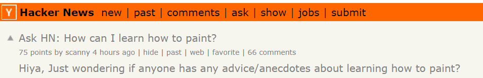

# Analyzing Hacker News.com Posts
This small project analyzes the activity in the comments section of posts taken from the [Hacker News](https://news.ycombinator.com/) website. The dataset used here however was downloaded from [kaggle.com](https://www.kaggle.com/hacker-news/hacker-news-posts). This dataset gathers posts from the year 2016, up to September 26 of that year. 

 

One way the data can reveal useful information is by looking at the number of comments and number of points obtained by the posts in Hacker News. This work was done in the attached [Notebook](https://github.com/marchhombre/My-Projects/Analyzing Hacker News Posts/Analyzing Hacker News Posts.ipynb)
