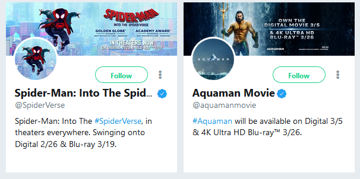
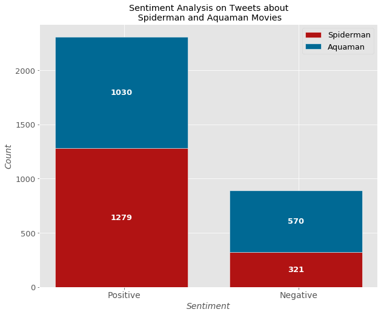

# Twitterverse Sentiment Analysis for Spiderman: Into The Spider-Verse(2018)  and Aquaman(2018) Movies
 

Gathering 1600 tweets with the Spiderman hashtag, and 1600 tweets using #Aquaman, the following graph was produced with the results from a trained Naive Bayes Classifier, a model that classified the sentiments of text as positive or negative. Note that no neutral category was given, so every tweet had to fall in either one of the two categories. Help in getting a thorough categorization will be appreciated.

 

### Notebook with code and results found [here](https://github.com/marchhombre/My-Projects/blob/master/Tweet's%20Sentiment%20on%20Spiderman%20and%20Aquaman/spiderman-and-aquaman-tweets.ipynb)
